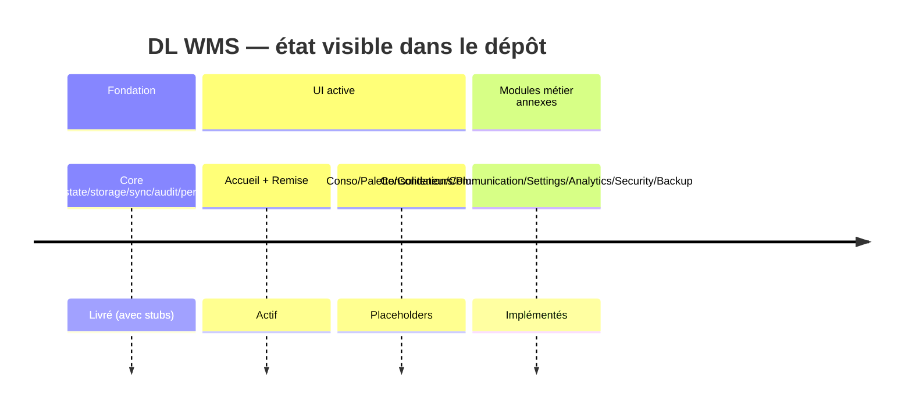
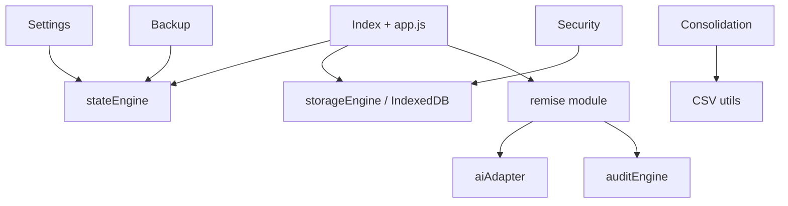

# Inventaire des pages et projets mentionnés — DL WMS (codebase)

## Résumé exécutif

Cet inventaire est construit à partir des sources primaires du dépôt `Nouvelle-edition` (README, interface `index.html`, routeur applicatif `js/app.js`, modules métier dans `js/modules/` et schémas JSON). Il couvre les pages réellement accessibles dans l'UI actuelle et les projets/volets fonctionnels présents dans le code.

## Portée et méthode

- Sources analysées: `README.md`, `index.html`, `js/app.js`, `js/modules/*.js`, `schemas/*.json`.
- Règle de classification:
  - **Page**: écran accessible ou rendu par navigation UI.
  - **Projet / volet**: domaine fonctionnel ou module applicatif.
- Limite: plusieurs modules existent en « skeleton » et ne sont pas tous exposés dans la navigation active.

## Inventaire des pages (UI)

## 1) Accueil (`accueil`)
- Point d'entrée affichant les compteurs de remises (pending, en cours).
- Fournit un bloc « Actions rapides » orienté vers le module Remise.
- Statut: **actif**.

## 2) Remise (`remise`)
- Page principale opérationnelle du flux de remise.
- Fonctions: génération d'une remise brouillon, ajout d'items, finalisation vers pending, traitement en cours, historique.
- Statut: **actif**.

## 3) Consolidation (`consolidation`)
- Accessible dans la navigation sous « Conso ».
- Rendu actuel côté `app.js`: placeholder « Module skeleton prêt ».
- Statut UI: **placeholder** (module métier existe séparément).

## 4) Palette (`palette`)
- Accessible dans la navigation sous « Palette ».
- Rendu actuel: placeholder.
- Statut UI: **placeholder**.

## 5) Conteneurs (`conteneurs`)
- Accessible dans la navigation sous « Cont. ».
- Rendu actuel: placeholder.
- Statut UI: **placeholder**.

## 6) Plus (`plus`)
- Entrée de navigation générique.
- Rendu actuel: placeholder.
- Statut UI: **placeholder**.

## Inventaire des projets / volets fonctionnels

## A) Noyau applicatif (Core)
- Gestion d'état, stockage local IndexedDB, synchro, journalisation, bus d'événements, audit, performance, UI engine, routeur.
- Statut: **fondation livrée** (selon README, avec certaines parties en stub/skeleton).

## B) Projet Remise
- Module métier le plus complet et branché à l'UI.
- Couvre le cycle draft → pending → in_progress → completed avec persistance.
- Inclut assistance IA heuristique (suggestions) et historique de traitement.
- Statut: **opérationnel (MVP avancé)**.

## C) Projet Consolidation
- Logique de parsing CSV, regroupement article/bin, fusion inventaire+réception, export CSV/Excel, impression.
- Présence d'un rendu de table côté module.
- Statut: **logique métier implémentée, exposition UI principale partielle**.

## D) Projet Réception
- Module dédié présent dans le code (`reception.js`) pour flux de réception.
- Statut: **implémentation présente, exposition UI principale à confirmer**.

## E) Projet Inventory
- Module dédié présent (`inventory.js`) pour inventaire.
- Statut: **implémentation présente, exposition UI principale à confirmer**.

## F) Projet Layout
- Module dédié présent (`layout.js`) pour gestion d'aménagement/placement.
- Statut: **implémentation présente, exposition UI principale à confirmer**.

## G) Projet Communication inter-sites
- Gestion de messagerie entre sites (Laval, Laval2, Langelier, Montreal, Quebec), boîte d'envoi/réception et filtres.
- Statut: **implémentation présente**.

## H) Projet Paramètres / Administration
- Réglages globaux (seuils, ordre de zones), sauvegarde complète JSON, restauration, import référentiel produits.
- Statut: **implémentation présente**.

## I) Projet Sécurité et intégrité
- Vérification d'intégrité de payload via checksum.
- Statut: **implémentation de base présente**.

## J) Projet Sauvegarde automatique
- Backup périodique de l'état applicatif (rotation des snapshots).
- Statut: **implémentation présente**.

## K) Projet Analytics
- Tracking des mouvements par zone, snapshots analytiques (scans, durée moyenne remise, zones actives).
- Statut: **implémentation présente**.

## Tableau maître (pages/projets)

| Type | Élément | Source | Statut actuel |
|---|---|---|---|
| Page | Accueil | `index.html` + `js/app.js` | Actif |
| Page | Remise | `index.html` + `js/app.js` + `js/modules/remise.js` | Actif |
| Page | Consolidation | `index.html` + `js/app.js` | Placeholder UI |
| Page | Palette | `index.html` + `js/app.js` | Placeholder UI |
| Page | Conteneurs | `index.html` + `js/app.js` | Placeholder UI |
| Page | Plus | `index.html` + `js/app.js` | Placeholder UI |
| Projet | Core | `README.md` + `js/core/*` | Livré partiel/stub |
| Projet | Remise | `README.md` + `js/modules/remise.js` | Opérationnel |
| Projet | Consolidation | `js/modules/consolidation.js` | Métier implémenté |
| Projet | Réception | `js/modules/reception.js` | Présent |
| Projet | Inventory | `js/modules/inventory.js` | Présent |
| Projet | Layout | `js/modules/layout.js` | Présent |
| Projet | Communication | `js/modules/communication.js` | Présent |
| Projet | Paramètres | `js/modules/settings.js` | Présent |
| Projet | Sécurité | `js/modules/security.js` | Présent |
| Projet | Sauvegarde | `js/modules/backup.js` | Présent |
| Projet | Analytics | `js/modules/analytics.js` | Présent |

## Timeline technique (état actuel)

## Dépendances (haut niveau)

## Prochaines actions recommandées

1. Brancher les modules `consolidation`, `palette`, `conteneurs`, `plus` vers des vues réelles au lieu de placeholders dans `app.js`.
2. Ajouter une matrice de statut officielle (Owner, priorité, échéance) pour chaque module.
3. Documenter les flux Réception/Inventory/Layout dans une section fonctionnelle dédiée du README.
4. Ajouter des tests unitaires pour `consolidation.js`, `communication.js` et `settings.js`.
